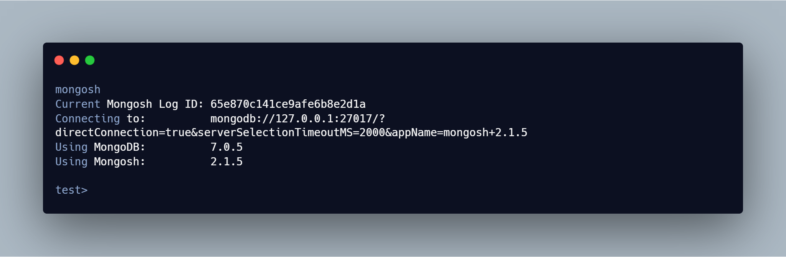
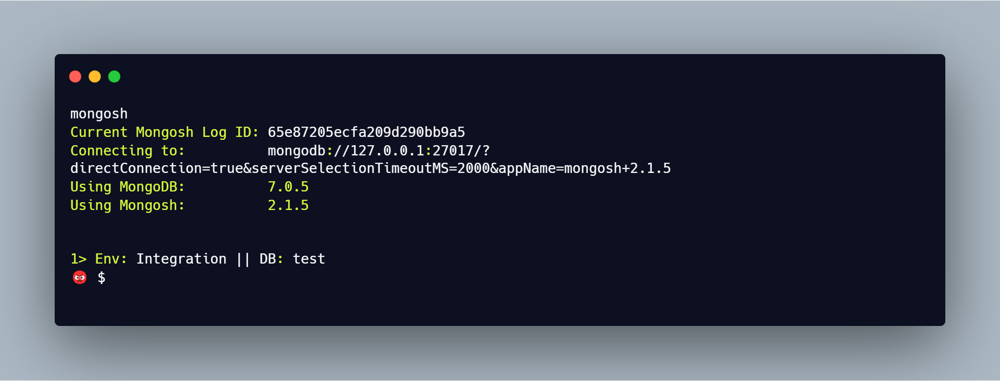

# MongoShell Prompt Customization

The Mongoshell will look for a `.mongoshrc.js` file in the home directory before loading the prompt.

## Default shell

This is how the shell looks by default




## Customization

I will be using `chalk` library to provide the colors to the mongoshell. Below is the contents of the `.mongoshrc.js` file.

```js
const chalk = require('chalk');


let cmdCount = 0;

prompt = () => {
  const mongoURIEnv = db.getMongo()._uri;
  if (mongoURIEnv.includes("tccustqual")) {
    return  (cmdCount++) + "> " + (chalk.black.bold("Env: ")) +(chalk.green.bold("Test"))
      + " || " + chalk.black.bold("DB: ") + chalk.magenta.bold(db.getName()) + " \n" + String.fromCodePoint(0x1F621) + " " + chalk.cyan.bold('$  ') 
  }
  else {
    return  (cmdCount++) + "> " + (chalk.black.bold("Env: ")) + (chalk.green.bold("Integration"))
      + " || " + chalk.black.bold("DB: ") + chalk.magenta.bold(db.getName()) + " \n" + String.fromCodePoint(0x1F621) + " " + chalk.cyan.bold('$  ') 
  }
}
```

This is how the shell looks after customization

